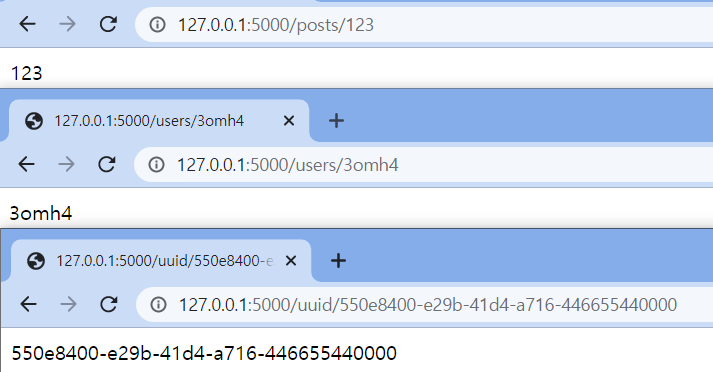

# 목차
1. [라우팅](#라우팅)  
    1-1. [정적라우팅](#정적라우팅)  
    1-2. [동적라우팅](#동적라우팅)  

# 라우팅

## 정적라우팅

```python
from flask import Flask

#애플리케이션 생성
app = Flask(__name__)

#웹페이지(주소) 접근 시 리턴
@app.route('/index')
@app.route('/')
def hello_world():
    return 'Hello, World!'

#애플리케이션 실행
if __name__ == '__main__':
    app.run(debug=True)
----------------------------
#실행
> set FLASK_APP=hello.py
> set FLASK_ENV=development
> flask run

```

* 복잡한 url을 쉽게 함수로 연결하는 방법으로 `route()`를 이용해 쉽고 빠르게 원하는 URL을 처리할 수 있다.  
  

  
### @app.route('/index')

http://localhost:5000/index 에 방문하면, 이 URL과 연결된 hello_world() 함수의 반환값이 브라우저에 나타난다.  
아래의 코드와 같은 결과를 반환한다. Flask 문서에 따르면 route() 함수는 add_url_rule() 함수를 호출한다고 한다.

```python
def hello_world():
   return 'hello world'
app.add_url_rule('/hello', 'hello_world', hello_world)
```
  
  
### 나머지 코드 설명

```python
app = Flask(__name__)
```

Flask 인스턴스를 생성하는 코드이다. 이때 `__name__`은 모듈의 이름이 저장되는 변수이다.

```python
##hello.py
print('hello 모듈 시작')
print('hello.py __name__:', __name__)
print('hello 모듈 끝')
--------------------------------------

##main.py
import hello
print('main.py __name__:', __name__)

--------------------------------------

##실행 결과
hello 모듈 시작
hello.py __name__: hello
hello 모듈 끝
main.py __name__: __main__
```

hello모듈을 가져오면, hello.py안에 코드가 실행되고 hello.py의 __name__변수에는 'hello'가 들어간다. main.py의 __name__변수에는 __main__이 들어간다. 만약 import없이 hello.py만 실행되면 __name__에 hello가 아닌 __main__이 들어가게 된다.

```
hello 모듈 시작
hello.py __name__: __main__
hello 모듈 끝
```

파이썬 인터프리터가 최초로 실행한 스크립트 파일의 __name__변수에는 __main__이 들어간다. 프로그램의 `시작점`이라는 뜻이다.

```python
if __name__ == '__main__'
```

따라서, 위의 코드는 프로그램의 시작지점이 맞는지 확인하는 부분이라고 볼 수 있다.

## 동적라우팅

```python
from flask import Flask

app = Flask(__name__)

@app.route('/users/<username>')
def get_user(username):
    return username

@app.route('/posts/<int:post_id>')
def get_post(post_id):
    return str(post_id)

@app.route('/uuid/<uuid:uuid>')
def get_uuid(uuid):
    return str(uuid)

if __name__ == '__main__':
    app.run(debug=True)
```

* path parameter 값에 따라 페이지에 표현되는 결과가 달라진다

### @app.route('/users/\<username>')

